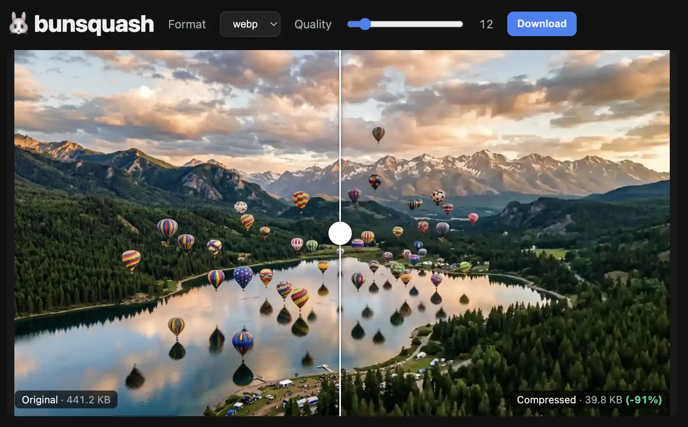

# 🐰 bunsquash

A tiny [Squoosh](https://squoosh.app) like image compressor in a single 100-line file, powered by [Bun's built-in image processing](https://bun.com/blog/bun-v1.3.14#bun-image-built-in-image-processing). No dependencies.



## Run

```bash
bun squash.ts
# → http://localhost:3000
```

(Use `bun --hot squash.ts` for live reload while editing.)

## Use

1. Drop an image onto the frame (or click to pick one).
2. Choose a format (webp / jpeg / png) and drag the quality slider.
3. Drag the divider to compare the original (left) against the compressed result (right).
4. Hit **Download** to save the compressed file.

It recompresses on load, when you release the quality slider, and when you switch format.

## How it works

The browser POSTs the raw image bytes to `/compress?format=…&quality=…`. The server pipes them through `Bun.Image` and streams the result back:

```ts
const img = new Bun.Image(await req.arrayBuffer())
const out = img[fmt](fmt === 'png' ? { compression: 9 } : { quality })
return new Response(out) // Content-Type set automatically
```

That is the whole engine: no `sharp` or native install step.

## Notes

- Everything (server + UI) lives in `squash.ts`.
